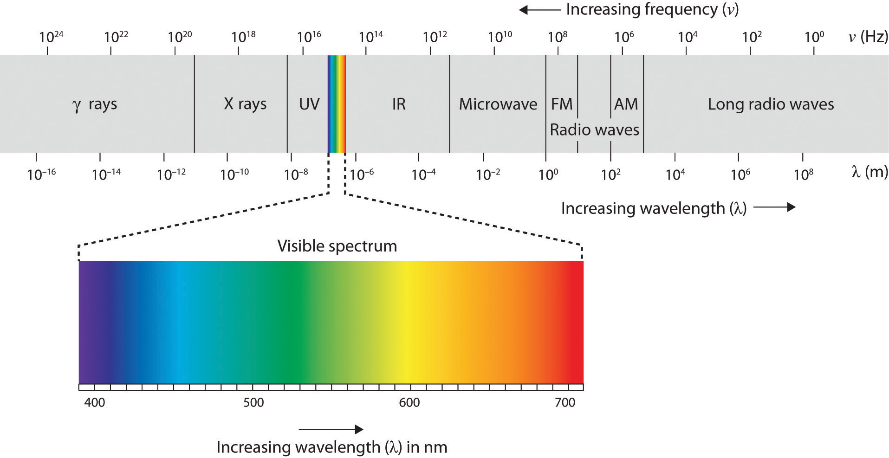

<!--

#Overview
 Challenges in imaging real-life
 Imaging everything (how we extend sensors to make images from things that are not usually thought of as images)
 Perspective on what we obtained from this and its impact on us (i.e. we have imaged outer space and electrons; we have an MRI machine capable of imaging inside of us without ever touching 🤯)
 Example(s) of how image-acquired characteristics of images come from what types of sensors they record, challenges/difficulties in computer vision change according to the image/data, not all data is RGB

-->

## Challenges in imaging real-life

## Imaging everything 

As seen in the first chapter, we rely on vision to make decisions. It is not surprising that, as a species, we have developed new ways of seeing beyond the range of what our eyes could capture.  We directed our colossal lenses toward the sky, using them to envision what was once unseen and unknown.  Additionally, we have delved into the microscopic realm, capturing images of the DNA structure and individual atoms. We will discuss here briefly the technology behind imaging these things, its impact on society and how this is relevant in the model building process. 

 As a species, we only see a fraction of the spectrum. We call that the visible spectrum. The image below shows us just how narrow it is: 

<!--

image https://open.lib.umn.edu/app/uploads/sites/2/2015/01/b4eaddac5823123ca0aa5e6abe24da3d.jpg 
from https://open.lib.umn.edu/intropsyc/chapter/4-2-seeing/ 

-->
We develop new ways to see beyond the visible spectrum by creating detectors that are capable of producing images in these domains.  Infrared (IR) is used in night vision devices and some astronomical observations.

 Magnetic resonance uses strong magnetic fields and radio waves to image soft human tissues. 

We created ways to see things that are not imaged by light. For instance, electron microscopy uses electrons to zoom in at much higher resolution than traditional light 
The goal of this chapter is not to make you an expert in all techniques, but to emphasize that different approaches are required for different imaging techniques. Each presents its own set of challenges, necessitating custom methods or a tailored set of techniques to address them.
<!--

#TODO add examples

-->
## Perspective on Imaging

<!--

#TODO 
Iconic pictures:
DNA Double Helix
The First Photo of a Black Hole
The Pale Blue Dot 
Brain Scans
Embryo development 
CRISPR Gene (gif in dna)

-->

## Image characteristics depend on acquisition