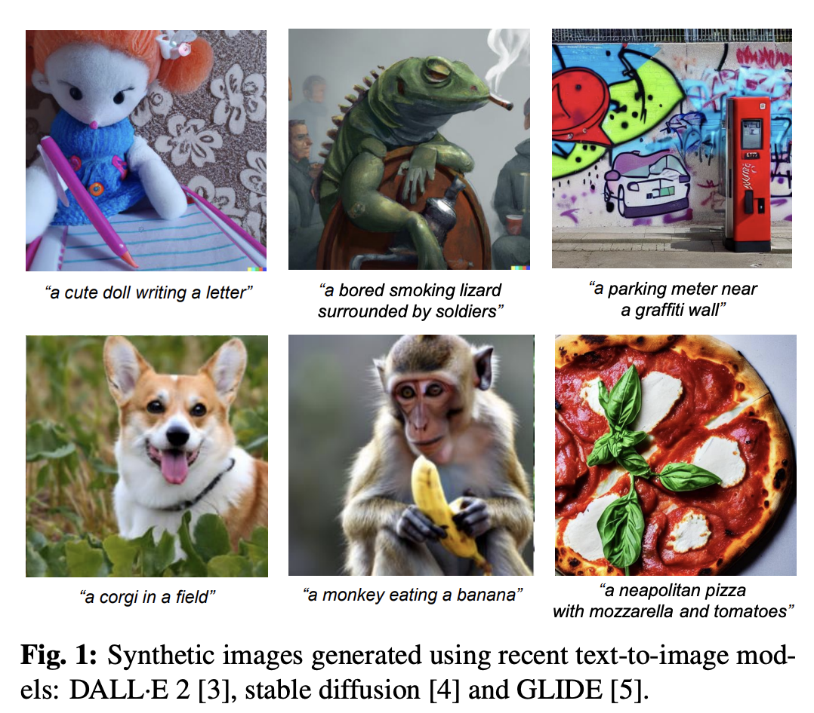
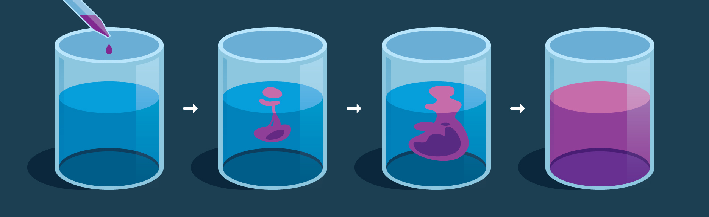
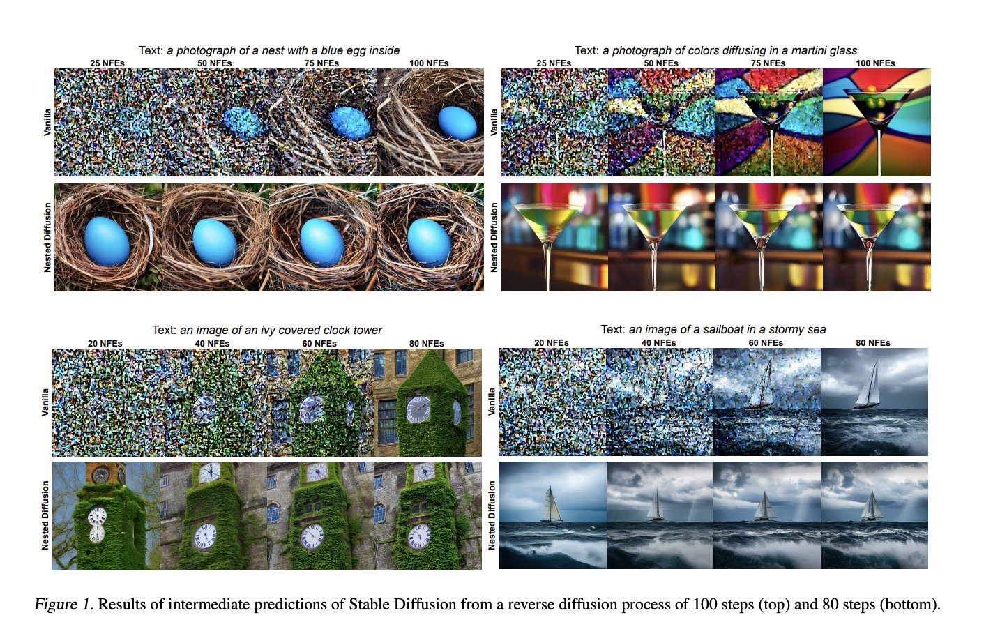
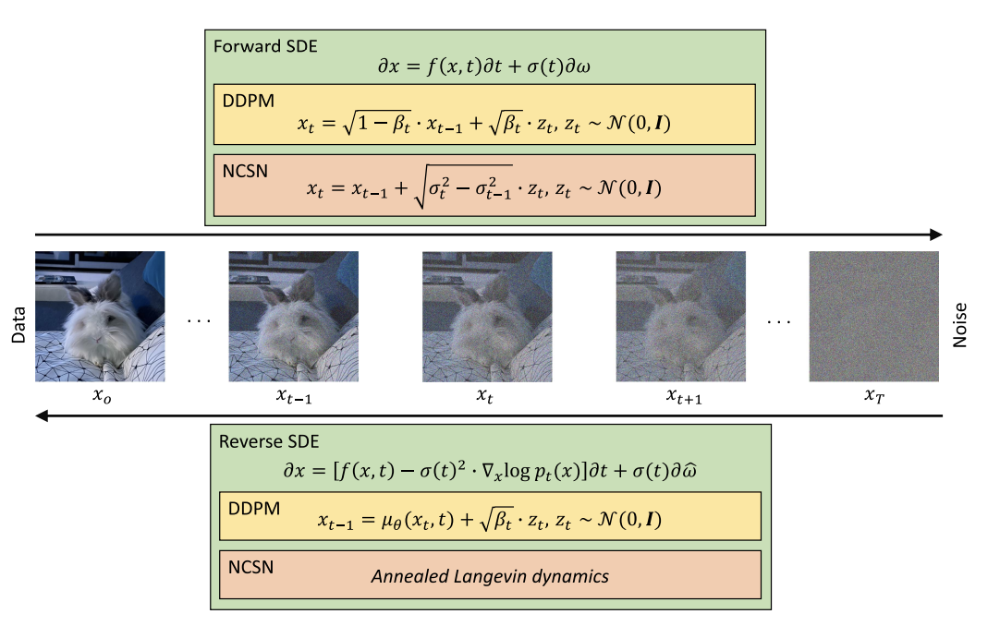

# Introduction to Diffusion Models

What you will learn from this chapter:

    - What are Diffusion models and how do they differ from GANs
    - Major sub categories of Diffusion models
    - Use cases of Diffusion models
    - Drawback in Diffusion models

## What are Diffusion models and how do they differ from GANs

Diffusion models are a new and exciting area in computer vision that has shown impressive results in creating images. These generative models work on two stages, a forward diffusion stage and a reverse diffusion stage: first, they slightly change the input data by adding some noise, and then they try to undo these changes to get back to the original data. This process of making changes and then undoing them helps generate realistic images.

These generative models raised the bar to a new level in the area
of generative modeling, particularly referring to models such
as Imagen and Latent Diffusion Models (LDMs). For instance consider the below images generated via such models

GANs were considered by many as state-of-the-art generative models in terms of the quality of the generated samples, before the recent rise of diffusion models. GANs are also known
as being difficult to train due to their adversarial objective,
and often suffer from mode collapse ( where the generator fails to capture the entire distribution of the training data, resulting in repetitive or limited samples). In contrast, diffusion models have a stable training process and provide more diversity
because they are likelihood-based.

However, diffusion models tend to be computationally intensive and require longer inference times compared to GANs due to the step-by-step reverse process.

Consider the below diffusion analogy for high level intuition;

The above is the traditional diffusion process where the drop of ink completely merges after sometime where dropped in a clean water glass. Practically reversing this is not possible, i.e to get the drop from the mixture. But this is what done in diffusion models, i.e removing noise and hence producing clean image.

In diffusion models, gaussian noise is added step-by-step on the training images to turn it completely into a junk noisy image. By this process the model learns to remove the noise step-by-step hence capable of turning any gaussian noisy image into a new diverse image (can be also conditioned based on text-prompts).

## Major sub categories of Diffusion models

There are 3 major diffusion modelling frameworks
- Denoising diffusion probabilistic models (DDPMs)
	- DDPMs are latent variable
models that employ latent variables to estimate the probability
distribution. From this point of view, DDPMs can be viewed as
a special kind of variational auto-encoders (VAEs), where
the forward diffusion stage corresponds to the encoding process
inside VAE, while the reverse diffusion stage corresponds to
the decoding process
- Noise conditioned score networks (NCSNs)
	- It is based on training a shared neural network via score matching
to estimate the score function (defined as the gradient of the
log density) of the perturbed data distribution at different noise
levels.
- Stochastic differential equations (SDEs)
	- It represents an alternative way to model diffusion, forming the third subcategory of diffusion models. Modeling diffusion via forward and reverse SDEs leads to efficient generation strategies as well as strong theoretical results. This can be viewed as a generalization over DDPMs and
    NCSNs.

## Use cases of Diffusion models

Diffusion is used in variety of task including, not limited to, ;
- Image generation - Generating images based on prompts
- Image super-resolution - Increasing resolution of images
- Image inpainting - Filling up degraded portion of a image based on prompts
- Image editing - Editing specific/entire part of the image without losing its visual identity.
- Image-to-image translation - This includes changing background, attributes of the location etc
- Learned Latent representation from diffusion models can also be used for
    - Image segmentation
    - Classification
    - anomaly detection

Want to play with diffusion models? No worries, Hugging Face's [Diffusers](https://huggingface.co/docs/diffusers/index) library comes to rescue. You can use almost all recent diffusion SOTA models for almost any task.

## Drawback in Diffusion models

The most significant disadvantage of diffusion models remains the need to perform multiple steps at inference time to generate only one sample. Despite the important amount of research conducted in this direction, GANs are still faster at producing images. 

Other issues of diffusion models can be linked to the commonly used strategy to employ CLIP embeddings for text-to-image generation. Few literature studies highlight that their model struggles to generate readable text in an image and motivate the behavior by stating that CLIP embeddings do not contain information about spelling. Therefore, when such embeddings are used for conditioning